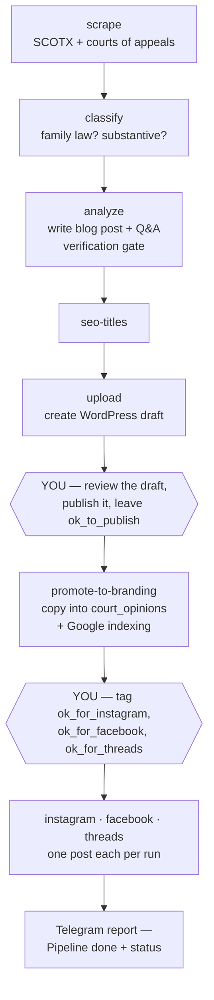
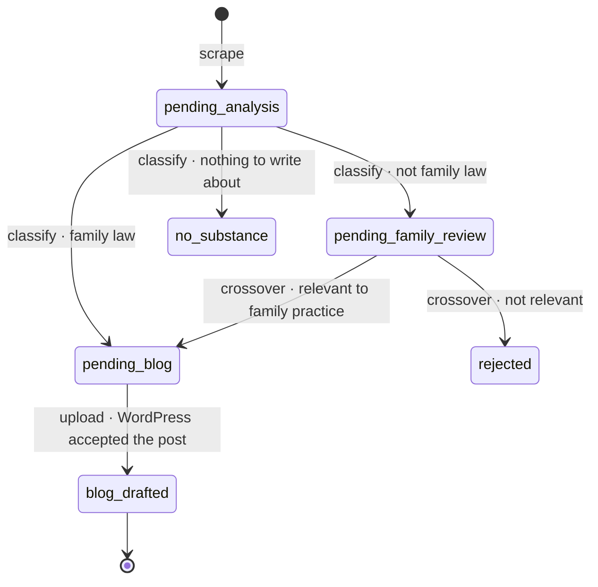
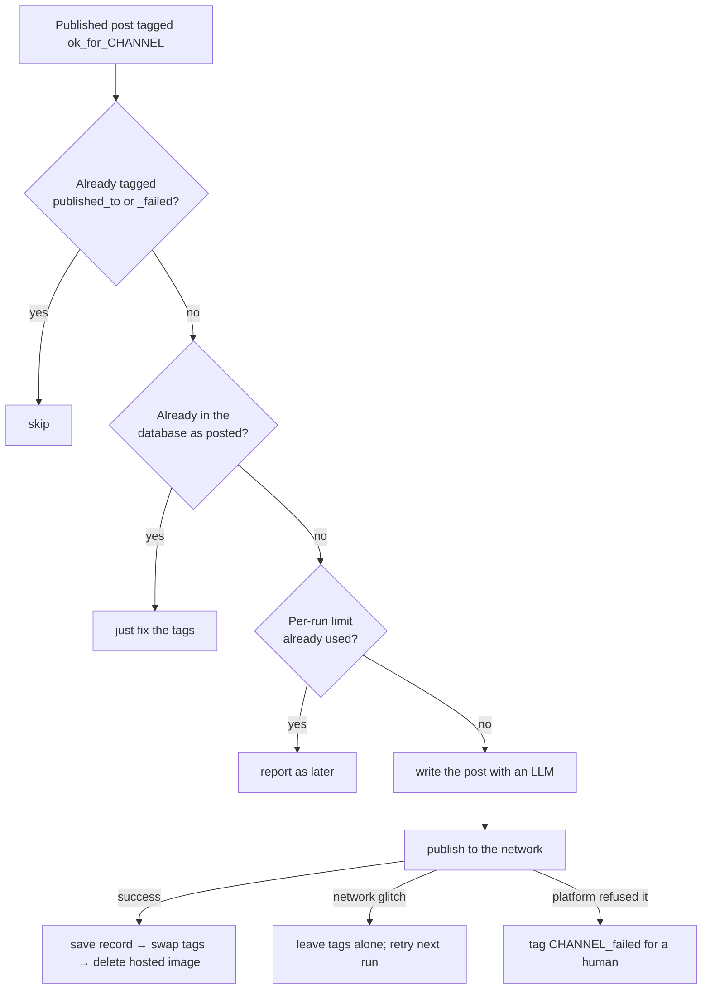

# Opinion Blogger — Operator's Manual

Everything needed to set up, run, and troubleshoot the pipeline that turns Texas
appellate opinions into blog posts and social media content.

**Audience:** whoever operates this system. Assumes you can run a shell command and
read a log, but not that you wrote the code.

- [1. What the system does](#1-what-the-system-does)
- [2. The pipeline](#2-the-pipeline)
- [3. State machines](#3-state-machines)
- [4. Social publishing](#4-social-publishing)
- [5. Day-to-day operation](#5-day-to-day-operation)
- [6. Command reference](#6-command-reference)
- [7. Setting up from scratch](#7-setting-up-from-scratch)
- [8. Deploying a change](#8-deploying-a-change)
- [9. Troubleshooting](#9-troubleshooting)
- [10. Known issues](#10-known-issues)
- [11. Where things live](#11-where-things-live)

---

## 1. What the system does

Twice a day the pipeline scrapes newly released opinions from the Texas appellate
courts, uses LLMs to decide which matter to family-law practitioners, writes a blog
post for each one, publishes it to WordPress as a draft, and — once you approve it —
migrates it to the branding site and posts about it on Instagram, Facebook and
Threads.

Two principles run through the whole system:

1. **Nothing reaches the public without a human tag.** Blog posts land as drafts;
   social posts only go out for posts you tagged.
2. **Every stage is resumable.** A stage that fails leaves its rows where they were,
   so the next run retries them. That's why a stuck queue, not a crash, is the usual
   symptom of a problem.
3. **The database records what happened; WordPress tags are a view of it.** A post is
   published because a row says so, not because a tag says so. Tags drive the
   handoffs and can drift; the rows are what keep anything from happening twice.

---

## 2. The pipeline

`scraper_job.py all` runs these stages in order. Each is also runnable alone.



**Stage by stage**

| Stage | What happens | Leaves behind |
|---|---|---|
| `scrape` | Pulls opinion lists and PDFs from the courts. | `opinion_tracking` rows at `pending-analysis` |
| `classify` | LLM decides family law or not, and whether the opinion has substance. | status becomes `pending-blog`, `pending-family-review`, or `no-substance` |
| (crossover) | Non-family cases are re-read for family-law relevance; winners are promoted and headlined `CROSSOVER:`. | `pending-blog` or `rejected` |
| `analyze` | Writes the post and Q&A, then an independent verifier checks the draft against the opinion. | `body`, `q_and_a`, `gate_passed`, `gate_report_html` |
| `seo-titles` | Fills in missing SEO titles. | `seo_title` |
| `upload` | Creates the WordPress post. Gate passed → draft tagged `ok_to_publish`. Gate failed → **pending** status, tagged `needs-human-review`, with the reviewer notes prepended to the body. | status `blog-drafted` |
| `promote-to-branding` | For each **published** post tagged `ok_to_publish`: copies it into `court_opinions`, swaps the tag to `published_to_landing_pages`, then requests Google indexing. | `court_opinions` row |
| `instagram` / `facebook` / `threads` | Publishes tagged posts. See [section 4](#4-social-publishing). | `social_posts` rows, `instagram_*` columns |

**Your two checkpoints** are the WordPress draft (nothing publishes itself) and the
social tags (nothing posts itself).

---

## 3. State machines

### `opinion_tracking.status`

One row per case number, created by the scrapers.



`analyze` reads `pending-blog` rows and writes the body **without changing the
status**; `upload` is what advances it. So a row sitting at `pending-blog` may or may
not already have a body.

### WordPress tags and categories

Tags drive every handoff. Slugs matter, names don't.

| Tag | Set by | Means |
|---|---|---|
| `ok_to_publish` | `upload` | Ready to migrate to the branding site, once you publish the post |
| `needs-human-review` | `upload` | The verification gate flagged it; migration skips it until you clear it |
| `publication_failed` | `promote` | Migration hit a real error. Blocks retries until removed |
| `published_to_landing_pages` | `promote` | Successfully migrated |
| `ok_for_instagram` / `ok_for_facebook` / `ok_for_threads` | **you** | Approved for that network |
| `published_to_instagram` / `..._facebook` / `..._threads` | publishers | Already posted there |
| `instagram_failed` / `facebook_failed` / `threads_failed` | publishers | The network refused it. Blocks retries until removed |
| `audience_attorneys` / `audience_public` | **you**, optional | Overrides the audience the writer would pick |

| Category | Meaning |
|---|---|
| `instagram` | Added after an Instagram post; feeds `thomasjdaley.com/instagram-posts/`, which the IG bio links to |
| `news` | Your own commentary with hand-made artwork. Facebook keeps that artwork instead of generating a card |

### Database tables

| Table | One row per | Notes |
|---|---|---|
| `opinion_tracking` | scraped case number | Working state of the pipeline |
| `court_opinions` | migrated opinion | Feeds the branding site; `instagram_*` columns record IG posts |
| `social_posts` | (WordPress post, channel) | Records Facebook/Threads posts; unique constraint prevents double-posting |
| `legal_subjects`, `canonical_questions`, … | supporting taxonomy | |

---

## 4. Social publishing

All three publishers share a shape: select by tag → generate content → publish →
**record it in the database** → swap the WordPress tags. Recording before tagging is
deliberate: if the tag swap fails, the next run sees the record and only re-tags,
never publishes twice.



### Per network

| | Instagram | Facebook | Threads |
|---|---|---|---|
| **Audience** | Attorneys | The public, always | Opinions → attorneys; commentary → classified |
| **Format** | 5-slide carousel, 1080×1350 | Photo post with a generated card, or link post for `news` | Text ≤500 chars + link |
| **Needs** | A `court_opinions` row (i.e. promoted) | Any published post | Any published post |
| **Link** | Not clickable; bio link only | Clickable in the caption | Clickable |
| **Record** | `court_opinions.instagram_*` | `social_posts` | `social_posts` |

**Instagram** renders five slides — cover, the question, the holding, practice
pointers, call to action — from the approved blog post, hosts them in Supabase
Storage so Instagram can fetch them, publishes the carousel, then deletes the hosted
images and adds the `instagram` category.

**Facebook** speaks to the public. Case-law posts are rewritten in plain English,
with parties referred to by role rather than name. Posts in the `news` category keep
your own artwork; everything else gets a generated card (cream background, question
headline, two or three checkmarked takeaways, your photo and the firm logo).

**Threads** mirrors the source: case-law posts talk to attorneys, commentary is
classified by a fast LLM call, and you can override either with an audience tag.

**Rate:** one post per network per run (`INSTAGRAM_MAX_POSTS_PER_RUN`,
`SOCIAL_MAX_POSTS_PER_RUN`). A backlog drains one at a time, twice a day. In a
report, a title under `later:` with no reason in parentheses means it's simply
waiting for the next run.

**Running two networks at once is fine.** Firing `facebook` and `threads` from
Telegram back to back is safe: each stage re-reads a post's tags immediately before
changing them, so one can't revert the other's work. See
[the tags entry in troubleshooting](#the-tags-dont-match-where-a-post-actually-went)
for what happens if they ever do drift.

**Previews** never post anything:

```bash
python scraper_job.py social-preview both <post-id-or-url>   # → social_previews/
python scraper_job.py instagram-preview <case_key>           # → instagram_previews/
```

The published wording is generated fresh, so it will differ slightly from a preview.
To re-render an Instagram carousel without paying for another LLM call, edit the
saved `content.json` and pass that file back to `instagram-preview`.

---

## 5. Day-to-day operation

### The scheduled runs

`opinion-blogger.timer` fires `scraper_job.py all` at **08:00 and 16:00** server
time. Each run ends with one Telegram message:

```
Pipeline done. pending-analysis=0 pending-family-review=0 pending-blog=0
rejected=2816 blog draft=0 awaiting promotion=11
Instagram: 1 published, 0 failed, 2 deferred.
  posted: … https://www.instagram.com/p/…
```

If the run crashes, systemd starts `opinion-blogger-failure.service`, which sends a
crash alert instead.

### Reading the status line

| Field | Healthy | What a stuck number means |
|---|---|---|
| `pending-analysis` | 0 after a run | Classification is failing — usually the LLM |
| `pending-family-review` | 0 after a run | The crossover review is failing |
| `pending-blog` | 0 after a run | `analyze` or `upload` is failing |
| `blog draft` | small | Drafts waiting for your review |
| `awaiting promotion` | falls each run | Promotion is failing, or you haven't published the drafts |
| `promote-failed` | absent | Posts that hit a real migration error; only appears when non-zero |
| `promote-held-for-review` | absent | Posts the gate flagged; clear the tag when satisfied |

A number that never falls is the signature of a broken stage. The pipeline still
reports "done," because each stage leaves its work for the next run rather than
crashing.

### Telegram

Commands come from your chat only; anything else is ignored.

| Command | Does |
|---|---|
| `status` | The status line above |
| `id` | Which server and version answered — confirms a deploy |
| `all` | Runs the whole pipeline now |
| `upload`, `promote`, `approve` | Runs that stage now |
| `instagram` / `facebook` / `threads` | Publishes one post to that network |
| `instagram dry` / `facebook dry` / `threads dry` | Lists what would post, posts nothing |
| `retry <case_number>` | Resets one case to `pending-analysis` and re-classifies it |
| `help` | The command list |

### Your routine

1. Read the "Pipeline done" message. Watch for counts that don't fall.
2. Review new WordPress drafts. Publish the good ones, leaving `ok_to_publish`.
   Clear `needs-human-review` on anything the gate flagged once you've checked it.
3. Tag posts worth sharing with `ok_for_instagram`, `ok_for_facebook`,
   `ok_for_threads`. Preview first if you want to see the copy.
4. Let the next scheduled run do the rest, or push it with a Telegram command.

---

## 6. Command reference

Run from the project directory; on the server, `venv/bin/python3.12`, on Windows,
`venv\Scripts\python.exe`.

**Pipeline**

| Command | Purpose |
|---|---|
| `scraper_job.py all` | The whole pipeline (what the timer runs) |
| `scraper_job.py scrape [all\|scotx\|coa]` | Scrapers only |
| `scraper_job.py classify` | Classify `pending-analysis` rows, then crossover review |
| `scraper_job.py analyze` | Write blog posts for `pending-blog` rows |
| `scraper_job.py seo-titles` | Backfill missing SEO titles |
| `scraper_job.py upload` | Push drafts to WordPress |
| `scraper_job.py promote-to-branding` | Migrate approved posts to `court_opinions` |
| `scraper_job.py index` | Google indexing for opinions not yet submitted |

**Social**

| Command | Purpose |
|---|---|
| `scraper_job.py instagram [--dry-run]` | Publish one carousel |
| `scraper_job.py social {facebook\|threads} [--dry-run]` | Publish one post |
| `scraper_job.py social-preview {facebook\|threads\|both} <id\|url>` | Write copy locally |
| `scraper_job.py instagram-preview [case_key\|content.json]` | Render slides locally |

**Maintenance**

| Command | Purpose |
|---|---|
| `scraper_job.py trash-empty-drafts` | Delete empty WordPress drafts left by a failed run |
| `scraper_job.py trash-empty-posts` | Same, for published posts |
| `scraper_job.py delete-empty` | Delete opinions with no scraped content |
| `scraper_job.py repair-case-names` | Re-derive case names *(currently broken — see §10)* |
| `scraper_job.py repair-q-and-a` | Re-derive Q&A |
| `scraper_job.py tag-opinions` | Opinion tagger backfill (dry run) |

---

## 7. Setting up from scratch

### 7.1 Accounts and services

| Service | Needed for |
|---|---|
| Supabase project | The database and the image bucket |
| WordPress (blog + branding sites) | Posts; needs an application password |
| OpenAI / Anthropic / Google / DeepSeek | The agents; at minimum the vendor in `LLM_VENDOR` |
| Telegram bot (via @BotFather) | Control and reporting |
| Meta app | Instagram, Threads and Facebook publishing |
| Google service account | Indexing API |

### 7.2 Code and dependencies

```bash
git clone <repo> && cd opinion_blogger
python3.12 -m venv venv
venv/bin/pip install -r requirements.txt
venv/bin/playwright install-deps chromium   # Linux only; needs sudo
venv/bin/playwright install chromium        # as the service user, never via sudo
```

Chromium renders the Instagram slides and Facebook cards. Install it **as the user
the services run as** (`ubuntu`), because it installs into that user's home
directory.

### 7.3 Configuration

Settings live in `util/settings.py` and are overridden by `.env`. The class sets
`extra = "forbid"`, so **a key in `.env` with no matching field stops the program at
startup**. Add the field first, then the key.

Essentials:

```ini
ID="prod"                       # appears in every Telegram message
VERSION="1.4.0"
LLM_VENDOR="openai"
OPENAI_API_KEY="…"
OPENAI_MODEL="…"
SUPABASE_URL="…"
SUPABASE_SERVICE_ROLE_KEY="…"
WP_BASE_URL="https://www.thomasjdaley.com/wp-json/wp/v2"
WP_USERNAME="…"
WP_APP_PASSWORD="…"
NOTIFICATION_VENDOR="telegram"
TELEGRAM_BOT_TOKEN="…"
TELEGRAM_CHAT_ID="…"
TELEGRAM_WEBHOOK_SECRET="…"
INSTAGRAM_ACCESS_TOKEN="…"      # long-lived; refreshed automatically
INSTAGRAM_USER_ID="…"
THREADS_ACCESS_TOKEN="…"
THREADS_USER_ID="…"
FACEBOOK_PAGE_ID="…"
FACEBOOK_PAGE_ACCESS_TOKEN="…"  # the PAGE token, not your user token
```

Useful knobs: `INSTAGRAM_MAX_POSTS_PER_RUN`, `SOCIAL_MAX_POSTS_PER_RUN`,
`SOCIAL_SCHEDULED_CHANNELS` (drop a network to pause it),
`SOCIAL_NEWS_CATEGORY`, `INSTAGRAM_FIRM_NAME`, `LOG_LEVEL`.

### 7.4 Database

Run every file in `db/migrations/` in the Supabase SQL editor, in order.
**Run migrations before deploying code that uses the new columns** — several code
paths write whole rows and fail if a column is missing.

The Supabase Storage bucket (`instagram-media`, public, JPEG-only) is created
automatically on first use.

### 7.5 WordPress

Create these tags (slugs exactly): `ok_to_publish`, `needs-human-review`,
`publication_failed`, `published_to_landing_pages`, `ok_for_instagram`,
`published_to_instagram`, `instagram_failed`, `ok_for_facebook`,
`published_to_facebook`, `facebook_failed`, `ok_for_threads`,
`published_to_threads`, `threads_failed`, and optionally `audience_attorneys` and
`audience_public`.

Create the categories `instagram` and `news`, and a page that lists posts in the
`instagram` category. That page is what the Instagram bio links to.

### 7.6 Meta: tokens

The fiddliest part of setup. All three networks live in one Meta app.

**Instagram** (Instagram Login, `graph.instagram.com`):
1. Convert the account to a professional (Business or Creator) account.
2. In the Meta app, add the Instagram product with **Instagram Login** and the
   permissions `instagram_business_basic` and `instagram_business_content_publish`.
3. Generate a long-lived token → `INSTAGRAM_ACCESS_TOKEN`; the numeric user ID →
   `INSTAGRAM_USER_ID`. Development mode is fine for posting to your own account.

**Threads** (`graph.threads.net`):
1. Add the Threads API use case with `threads_basic` and `threads_content_publish`.
2. Add your Threads account as a tester and accept the invite in the Threads app.
3. Generate a long-lived token → `THREADS_ACCESS_TOKEN`. Get the user ID from
   `GET https://graph.threads.net/v1.0/me?fields=id,username` → `THREADS_USER_ID`.

**Facebook** (`graph.facebook.com`) — the one with traps:
1. Add the Pages use case with `pages_manage_posts`, `pages_read_engagement` and
   `pages_show_list`. If the Page belongs to a business portfolio, also add
   `business_management`, or the Page will be invisible to the API.
2. In Graph API Explorer, generate a user token with those permissions.
3. In the Access Token Debugger, click **Extend Access Token** for a long-lived one.
4. Call `me/accounts` with the extended token. From your Page's entry, copy `id` →
   `FACEBOOK_PAGE_ID` and `access_token` → `FACEBOOK_PAGE_ACCESS_TOKEN`.

Verify: debugging the Page token should show type **PAGE**, your Page's name, and
**Expires: Never**. A Page token derived from a long-lived user token doesn't expire;
Instagram and Threads tokens last 60 days and are refreshed weekly by the code, which
stores them in `instagram_token.json` / `threads_token.json` (per machine, git-ignored).
A failed refresh is reported in that run's Telegram message.

### 7.7 Telegram webhook

Point the bot at the server and set a secret:

```
https://api.telegram.org/bot<TOKEN>/setWebhook?url=https://<host>/webhooks/telegram/updates&secret_token=<TELEGRAM_WEBHOOK_SECRET>
```

### 7.8 systemd

Install the units from `deploy/`:

| Unit | Role |
|---|---|
| `opinion-blogger.timer` | Fires at 08:00 and 16:00 |
| `opinion-blogger.service` | One pipeline run (oneshot) |
| `opinion-blogger-failure.service` | Crash alert, via `OnFailure=` |
| `opinion-blogger-webhook.service` | The Telegram listener (uvicorn, port 8080, always on) |

```bash
sudo systemctl daemon-reload
sudo systemctl enable --now opinion-blogger.timer opinion-blogger-webhook.service
```

---

## 8. Deploying a change

1. Run any new `db/migrations/*.sql` **first**.
2. Add new `.env` keys on the server (the field must exist in `settings.py`).
3. `git pull && venv/bin/pip install -r requirements.txt`
4. If Playwright or its browser changed: `venv/bin/playwright install chromium`.
5. **Restart the webhook** if Telegram commands or any code it imports changed:
   `sudo systemctl restart opinion-blogger-webhook.service`. It's a long-running
   process and keeps old code in memory until restarted.
   The timer service is oneshot and needs no restart.
6. Verify: send `id` (confirms the restart) and `status` (confirms the database and
   WordPress are reachable), then `instagram dry`.

---

## 9. Troubleshooting

**Start here:** send `status`. A queue that isn't draining names the broken stage.

### A queue isn't draining

| Stuck at | Check |
|---|---|
| `pending-analysis` | Run `classify` by hand and read the error. Almost always the LLM: a retired model, a bad key, or a rejected request |
| `pending-blog` | Run `analyze`, then `upload` |
| `awaiting promotion` | Run `promote-to-branding` by hand. Also confirm the drafts are actually **published** — promote only looks at published posts |

### "Everything with an LLM is failing"

A model change can break every agent at once, because they all request structured
output. If a stage fails with a 400 from the provider, read the message: it usually
names the fix. One real example: a reasoning model rejected the chat-completions
endpoint, fixed by using the Responses API in `agents/util.py`. Test any model change
with `social-preview` before a scheduled run.

### A social post won't go out

Run the dry run for that network. It reports the reason:

| Report says | Means | Fix |
|---|---|---|
| `N post(s) held by the 'CHANNEL_failed' tag` | An earlier attempt was refused | Fix the cause, remove the tag |
| `not migrated to court_opinions yet` (Instagram) | The post hasn't been promoted | Run `promote-to-branding` |
| a title under `later:` with no reason | Per-run limit | Wait for the next run, or run again |
| `CHANNEL not configured (missing …)` | Credentials absent | See §7.6 |
| `0 approved` | No post carries the `ok_for_CHANNEL` tag | Tag one |

### Instagram fails while Facebook and Threads work

Chromium is missing or was installed as the wrong user. Re-run
`venv/bin/playwright install chromium` as the service user and test with
`instagram-preview`, which renders without posting.

### Facebook rejects everything

Debug `FACEBOOK_PAGE_ACCESS_TOKEN`. It must be type **PAGE** and match
`FACEBOOK_PAGE_ID`; a user token, or a token for a different Page, fails here. If
your Page is missing from `me/accounts`, it's probably in a business portfolio and
the token needs `business_management`.

### Posts tagged `publication_failed`

Not every one is a real failure. Before clearing them, check whether the opinion is
already in `court_opinions`: a post can migrate successfully and still get tagged if
the follow-up tag update fails. Companion cases (one opinion, several case numbers)
also land here; the current code treats a duplicate-key rejection as "already
migrated" and tags the post done instead.

### Telegram commands behave like old code

The webhook wasn't restarted. Send `id` to confirm which version answered.

### A post was published twice

Shouldn't happen: each publisher records the post before swapping tags, and
`social_posts` has a unique constraint per post and channel. If it does, check
whether the record was written — that's the guard.

### The tags don't match where a post actually went

**The database is the truth; tags are a view of it.** A post can be live on a
network while still carrying `ok_for_<channel>`, usually because two stages wrote
the post's terms at nearly the same moment.

WordPress replaces a post's whole tag list on every write, so a stage that sends a
list built from an older snapshot reverts whatever another stage changed in between.
All tag writes now go through `post_migrator.update_terms()`, which re-reads the
current tags immediately before writing and touches only its own. Within a single
process that read-and-write pair can't be interrupted; across processes (a scheduled
run overlapping a Telegram command) a small window remains.

It heals itself: the next run for that network finds the record in `social_posts`
(or `court_opinions.instagram_media_id`), re-tags the post, and reports
`note: re-tagged already-posted …`. Seeing that note repeatedly for the same post
means two stages are fighting over its tags.

To reconcile by hand, read `social_posts` and, for each row, add
`published_to_<channel>` and remove `ok_for_<channel>` via `update_terms`. Never
re-run a publisher to "fix" tags: the record already stops it from posting again,
and it will only re-tag.

---

## 10. Known issues

- **Companion cases.** One opinion can cover many case numbers, and each gets its own
  tracking row and near-identical blog post. Only the first migrates; the rest are
  rejected by unique constraints and are now tagged as already-migrated. Common in
  criminal appeals, and so in `CROSSOVER` posts. A real fix would deduplicate before
  the posts are created.
- **`repair-case-names` does nothing.** `GEMINI_FAST_MODEL` names a retired model, so
  the agent errors on every row and the command logs failures silently. Point it at a
  current model to fix. The scheduled pipeline doesn't use it.
- **Preview wording differs from what publishes.** Text is regenerated at publish
  time. To publish exact text, edit the saved `content.json` (Instagram only).
- **LinkedIn isn't automated.** Posts are reshared there by hand; LinkedIn tokens
  expire every 60 days with no automatic refresh.

---

## 11. Where things live

```
scraper_job.py          CLI entry point; every stage is a cmd_* function here
core.py                 Shared analysis helpers, crossover review
classify_opinions.py    pending-analysis → classified
opinion_analyzer.py     Blog post + Q&A generation, verification gate
wp_uploader.py          Creates WordPress posts
post_migrator.py        promote-to-branding, Google indexing, WP tag helpers
notifier.py             Vendor-neutral send/reply/status_summary
notifiers/telegram/     Outbound messages + the inbound command webhook
agents/                 One module per LLM agent
agents/prompts/         Every prompt, as plain text
instagram/              Carousel: models, content, renderer, storage, graph, publisher
instagram/assets/       Fonts, headshot, firm logo (shared with Facebook cards)
social/                 Threads + Facebook: source, compose, card, channels, publisher
social/cards/           Facebook card template
db/                     Models, repositories, connection, migrations
deploy/                 systemd units, crash alert, HAProxy snippet
docs/                   This manual and the verification-gate write-up
```

**Runtime files, git-ignored:** `instagram_token.json`, `threads_token.json`,
`instagram_previews/`, `social_previews/`, `scotx/` (PDFs), `draft_posts/`.
