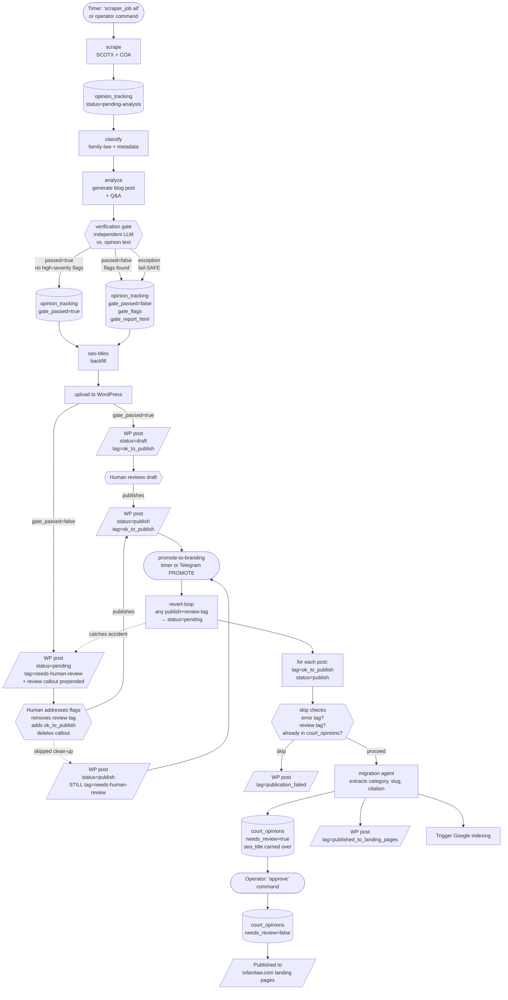

# Opinion Blogger Workflow (with Verification Gate)

End-to-end flow from a court releasing an opinion to that opinion appearing on
txfamlaw.com. Highlights the verification gate, the WordPress human-review
branch, and the revert-loop backstop introduced by the integration patches.

## Pipeline

## Key states & guarantees

### `opinion_tracking.gate_passed`

- **`true`**  — gate ran and found no high-severity or policy-violation flags. Post goes to the normal draft track.
- **`false`** — gate flagged the draft OR the gate failed to run. Post goes to the pending-review track with a red callout block prepended to the body.
- **default** for new rows is `false`, so anything that bypasses the gate (e.g. partial pipeline run) routes to review by construction.

### WordPress post states

| State | Status | Tags | Meaning |
|---|---|---|---|
| Fresh draft, gate cleared | `draft` | `ok_to_publish` | Awaiting routine human review |
| Fresh draft, gate flagged | `pending` | `needs-human-review` | Awaiting human reconciliation against the gate's flags |
| Cleared & live | `publish` | `ok_to_publish` | Eligible for migration to `court_opinions` |
| Successfully migrated | `publish` | `published_to_landing_pages` | Already in `court_opinions`; will be skipped on next migrate pass |
| Migration error | (any) | `publication_failed` | Skip-check trips; surfaces to operator for investigation |
| Accidentally published while flagged | `publish` | `needs-human-review` | The revert-loop will yank back to `pending` on the next `process_workflow` call |

### Two human gates

1. **WordPress review** — the human reads the draft (and the gate callout if present), fixes anything, and publishes.
2. **`approve` command** — flips `court_opinions.needs_review` from `true` → `false`, exposing the post on txfamlaw.com landing pages.

### Backstop

The revert-loop runs at the **top** of every `process_workflow` invocation (timer-driven `promote-to-branding` and Telegram PROMOTE share this code path). Any post that is `status=publish` but still carries `needs-human-review` gets demoted back to `pending`. Protects against absent-minded publishes of a still-flagged draft.

## What's running where

| Component | Runs as | Triggers `process_workflow` |
|---|---|---|
| `scraper_job all` | systemd timer | Yes (terminal step) |
| `scraper_job promote-to-branding` | manual CLI | Yes |
| Telegram `promote` command | `opinion-blogger-webhook.service` (uvicorn) | Yes |

Note: the Telegram webhook is a separate long-lived process. After deploying changes to `post_migrator.py`, restart `opinion-blogger-webhook.service` so the new module gets loaded.
